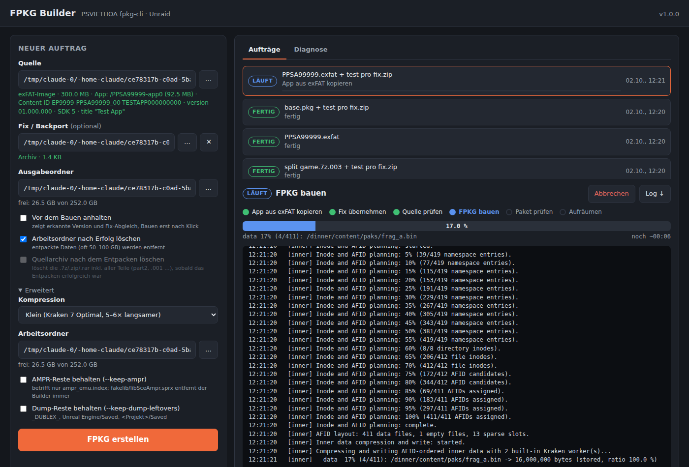

# fpkg-webui

Weboberfläche für Unraid zum Erstellen von PS5-FPKGs (Debug-Pakete) mit dem
[PSVIETHOA FPKG Builder](https://github.com/thanhsondev/PSVIETHOA-FPKG-Builder) (`fpkg-cli`).

Quelle auswählen, optional einen Fix/Backport drüberlegen, „FPKG erstellen“ – den Rest
(Entpacken, Kopieren, Prüfen, Bauen, Kontrolle) erledigt der Container.



## Funktionen

- **Quellen:** `.7z`, `.zip`, `.rar` (auch mehrteilig: `.7z.001`, `.part1.rar`, `.r00`, `.z01`),
  `.exfat`, `.ffpfsc`, `.ffpkg`, `.pkg` oder ein App-Ordner (`sce_sys` + `eboot.bin`).
  Was in einem Archiv steckt, wird automatisch erkannt.
- **Fix/Backport:** Archiv oder Ordner wird 1:1 über den App-Ordner gelegt. Vorher zeigt die
  Oberfläche, welche Dateien ersetzt werden und welche neu sind. Nach dem Bau wird geprüft, ob
  alle Fix-Dateien im Paket gelandet sind.
- **exFAT + Fix ohne Mount:** eigener exFAT-Leser (reines Python, auch MBR/GPT-Images),
  der Container braucht keine Privilegien.
- **Fortschritt:** Schritt-Leiste und Balken mit Restzeit für Entpacken, Kopieren und Bauen.
- **Vor dem Bauen anhalten** (Standard): erkannte Version und Fix-Abgleich prüfen, dann „Bauen“.
- **Quellarchiv nach dem Entpacken löschen** (Standard: aus) – inklusive aller Teile.
- **Watch-Ordner:** Was fertig im Eingang landet (z. B. von SABnzbd/JDownloader), wird automatisch gebaut.
  Unvollständige Downloads (`.part`, `_UNPACK_…`) werden erkannt, ein Fix wird über die Title-ID im Namen
  (z. B. `PPSA11386 PSSR Fix.zip`) aus dem Fix-Ordner zugeordnet, die Quelle landet danach in `_erledigt`.
- **Prüfsumme:** liegt eine `SHA-256.txt`, `*.sha256`, `SHA256SUMS`, `*.md5` oder `*.sfv` neben der Quelle,
  wird vor dem Entpacken geprüft – auch über alle Teile mehrteiliger Archive.
- **Überlappende Warteschlange:** während ein Auftrag baut, wird der nächste schon vorbereitet.
- **Pushover:** Nachricht bei fertig, Fehler und „wartet auf Freigabe“.
- **Passwortgeschützte Archive:** Passwort im Auftrag eintragen oder eine Liste unter
  *Einstellungen → Archiv-Passwörter* hinterlegen (Klartext in `/config/settings.json`).
  Ohne passendes Passwort bricht der Auftrag mit klarer Meldung ab.
- **Warteschlange**, Abbrechen, Neu starten, Arbeitsordner aufräumen.
- **Pakete:** Liste der fertigen Pakete mit Version, benötigter Firmware und SDK; Schnell- und Vollprüfung per Klick.
- **Sicheres Abbrechen:** Abbrechen nur über das Menü „⋯ Mehr“ mit Dialog, der genau sagt, was passiert.
- **Diagnose:** Versionen, gemappte Ordner mit freiem Platz und Schreibrecht, Selbsttest,
  Server-Log, Download eines Diagnose-Pakets (ZIP mit Logs und Auftragsliste), Log je Auftrag.

## Installation auf Unraid

### Über das Template

1. Template auf den Stick legen (Unraid-Terminal):
   ```bash
   mkdir -p /boot/config/plugins/dockerMan/templates-user && curl -fsSL -o /boot/config/plugins/dockerMan/templates-user/my-fpkg-webui.xml https://raw.githubusercontent.com/cosmicflow2512/fpkg-webui/main/unraid/fpkg-webui.xml
   ```
2. *Docker → Add Container → Template: fpkg-webui* wählen.
3. Pfade anpassen (siehe unten), *Apply*.
4. WebUI öffnen (Standard-Port 8099; 8095 ist oft von Music Assistant im Host-Netz belegt) → Tab *Diagnose* → *Selbsttest*.

Das Image wird von GitHub Actions nach `ghcr.io/cosmicflow2512/fpkg-webui` gebaut.
Nach dem ersten Build das Paket unter *GitHub → Packages → fpkg-webui → Package settings*
auf **Public** stellen, sonst kann Unraid es nicht ohne Login ziehen.

### Lokal bauen (ohne GitHub)

```bash
cd /mnt/user/appdata/fpkg-webui/src && bash install.sh
```
Baut das Image aus dem Ordner, legt das Template ab und startet den Container.
Pfade per Umgebungsvariablen: `SHARES="/mnt/user/NZB:NZB /mnt/user/isos:isos" OUT=… WORK=… bash install.sh`.

## Pfade

| Container-Pfad | Zweck |
|---|---|
| `/shares/<Name>` | Quell-Shares. **Jeder** Ordner unter `/shares/` erscheint im Dateibrowser. Weitere Shares per *Add another Path* mit Container-Pfad `/shares/<Name>` |
| `/output` | fertige `.pkg`-Dateien |
| `/work` | entpackte Spiele und Build-Temp – braucht ca. das 1,6-fache der entpackten Größe. Am schnellsten direkt auf einem NVMe-Pool (`/mnt/<pool>/…`), nicht über `/mnt/user` und nicht auf dem Array mit Parität |
| `/config` | Auftragsliste, Logs (`logs/server.log`, `logs/jobs/*.log`) |

Variablen: `PUSHOVER_USER`, `PUSHOVER_TOKEN`, `WEBUI_URL` (haben Vorrang vor der WebUI),
`PUID`/`PGID` (Besitzer der fertigen Pakete, Standard 99/100), `LOG_LEVEL` (`INFO`/`DEBUG`),
`BROWSE_ROOTS` (Standard `/shares/*:/output:/work`).

## Einstellungen

Reiter *Einstellungen* (gespeichert in `/config/settings.json`):

| Bereich | Optionen |
|---|---|
| Warteschlange | Überlappend arbeiten, Prüfsumme standardmäßig prüfen |
| Watch-Ordner | Eingang (Standard `/shares/NZB/fpkg-inbox`), Fix-Ordner (`/shares/NZB/fpkg-fixes`), Stillstand vor Start, Prüfintervall, Kompression, Anhalten vor dem Bauen, Arbeitsordner/Archiv löschen, Quelle nach `_erledigt` verschieben |
| Pushover | User Key, API Token, Link in der Nachricht, Ereignisse |

Bereits verarbeitete Einträge merkt sich der Watch-Ordner in `/config/watch_state.json`; mit ↻ in der Liste
lässt sich ein Eintrag erneut verarbeiten.

## Was man wissen muss

- Ergebnis ist ein **Debug-FPKG** (FIH, PLAINTEXT_NOAUTH) – installierbar auf einer PS5 mit Debug-Modus.
- Gebaut wird mit der eingebauten Engine (`--no-sony-sdk`). Der Sony-SDK-Weg (Update-Pakete mit
  `--sdk-reference`) braucht Wine und ist nicht enthalten.
- `fakelib/libSceAmpr.sprx` entfernt der Builder **immer** aus dem Paket, auch mit `--keep-ampr`
  (das betrifft nur `ampr_emu.index`). Die Oberfläche warnt, wenn ein Fix diese Datei enthält.
- Der Builder lässt Unreal-Dump-Reste (`Engine/Saved`, `<Projekt>/Saved`, `_DUBLEX_`) standardmäßig weg.
- `.ffpfsc` ist komprimiert und kann nicht gepatcht werden – ohne Fix bauen geht.
- Gleichnamige Pakete werden nicht überschrieben, das neue bekommt die Auftrags-ID angehängt.
- **Kein Login.** Nur im LAN betreiben, nicht ungeschützt über einen Reverse-Proxy freigeben.

## Fehlersuche

Tab *Diagnose*:
- *Selbsttest* prüft fpkg-cli, Engine, Debug-Keys, 7-Zip (inkl. RAR), gemappte Ordner,
  Schreibrechte und freien Platz.
- *Diagnose-Paket ↓* lädt ein ZIP mit `diagnose.json`, Server-Log, Auftragsliste und den letzten
  15 Auftrags-Logs – das bei Problemen an ein Issue anhängen.

Container-Log: `docker logs fpkg-webui`.

## Entwicklung

```bash
python3 tests/test_basic.py          # Archiv-Teile, Klassifizierung, Fortschritt, exFAT-Leser
cd app && DATA_DIR=/tmp/fpkg BROWSE_ROOTS=/pfad/zu/test FPKG_CLI=/pfad/fpkg-cli SEVENZ=7zz python3 server.py
```

Keine Abhängigkeiten außer Python 3.11 (Standardbibliothek), `fpkg-cli` und 7-Zip.

## Credits

- [PSVIETHOA FPKG Builder](https://github.com/thanhsondev/PSVIETHOA-FPKG-Builder) – Nguyễn Thanh Sơn & Ngô Phi Phương
- LibProsperoPkg – Drakmor
- [7-Zip](https://www.7-zip.org) – Igor Pavlov

Beide werden beim Image-Build von den offiziellen Releases geladen (SHA-256 gepinnt) und nicht in
diesem Repository verteilt.

## Lizenz

Code in diesem Repository: MIT (siehe `LICENSE`). Für fpkg-cli und 7-Zip gelten deren eigene Lizenzen.
Nur für eigene Backups und Homebrew verwenden.
